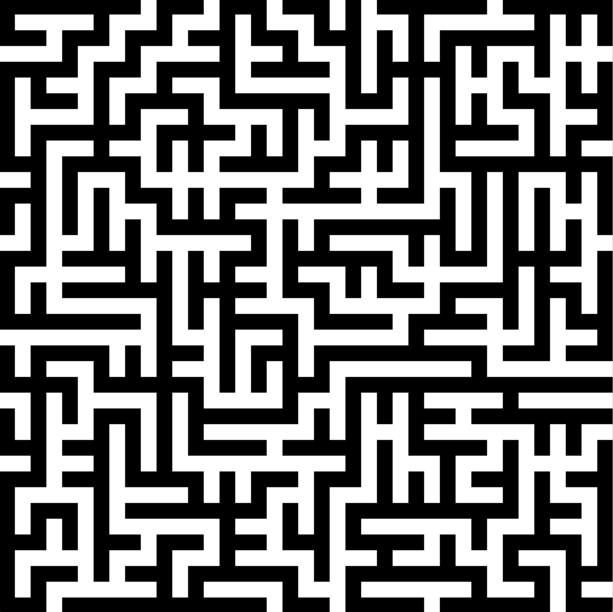
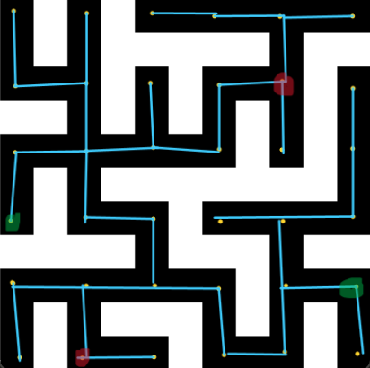
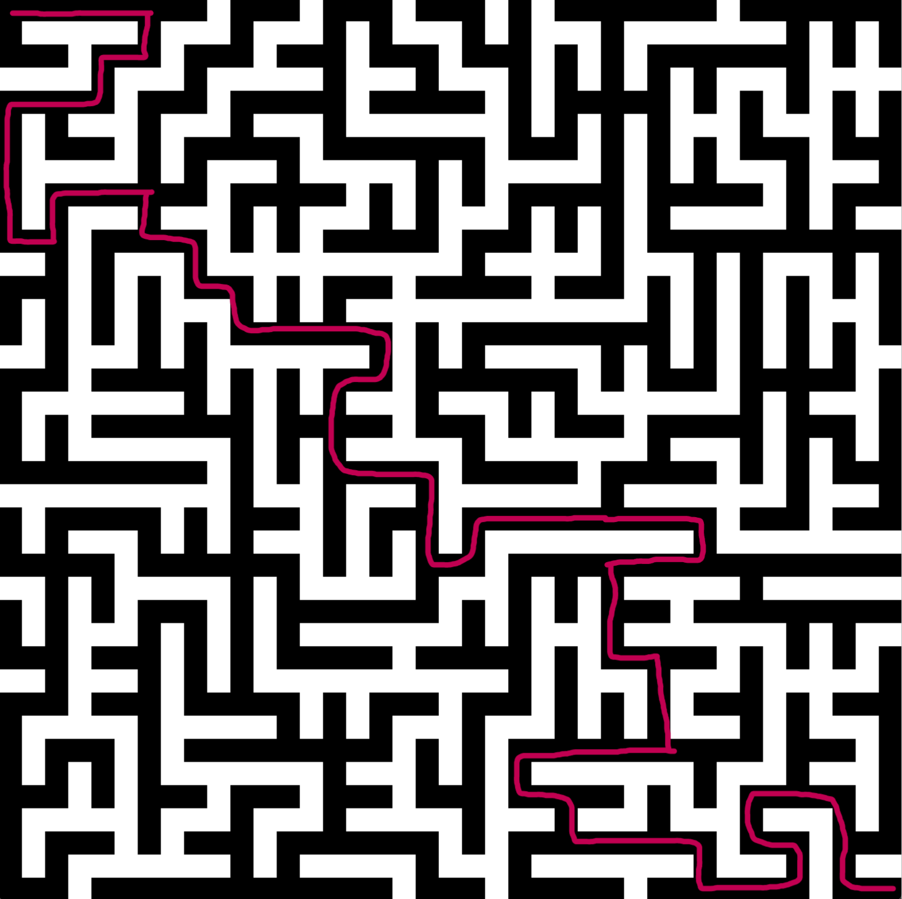
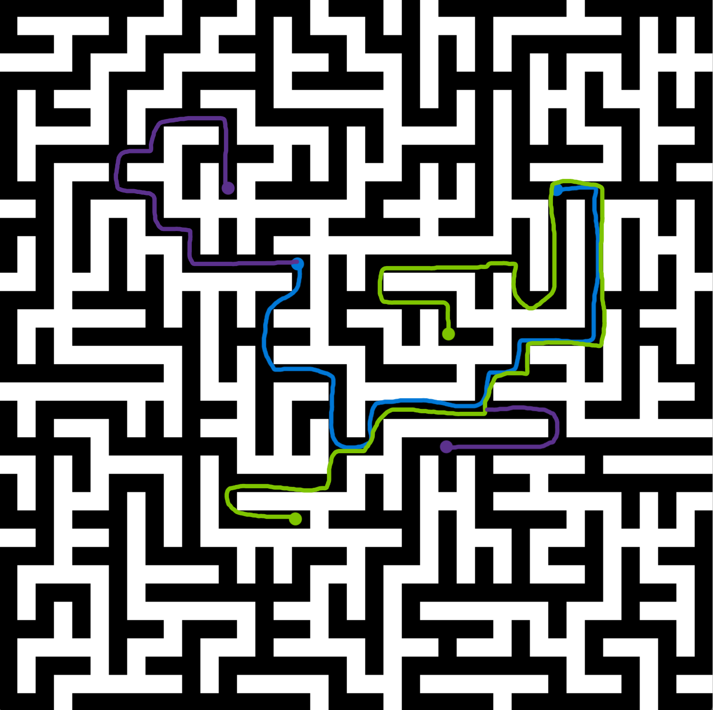

# About 

A Quil sketch that generates a random maze.

Walls are white.

To make your own random maze, make sure you have Java installed, download the released .jar file and double-click it.

# How it works

First, a spanning tree of a grid graph is generated. This works by choosing random edges
of a grid and avoiding the creation of cycles. For a 6x6 grid graph, the spanning tree is the blue lines:

From the spanning tree it is possible to make a cell array (bunch of square tiles that make a grid)
by scaling and interpolating between the vertices.

# Some mazes

Since the maze is based on a spanning tree, every black cell is connected. 
Someone walking around the maze could visit anywhere starting from anywhere.

