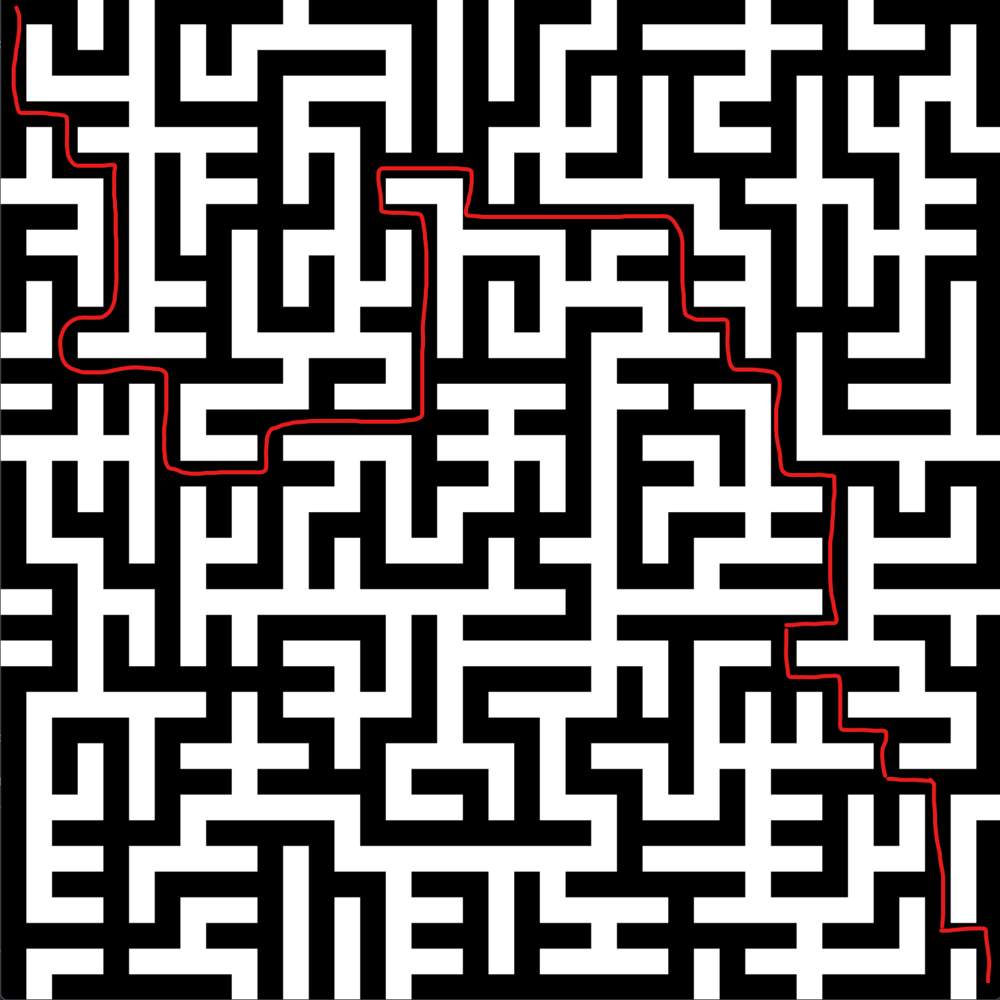

A Quil sketch that generates a random maze (a random spanning tree of a grid graph).

The maze goes from the top left corner to the bottom right corner. Walls are white.

To make your own random maze:

`java -jar .\target\maze-gen-0.1.0-SNAPSHOT-standalone.jar`
